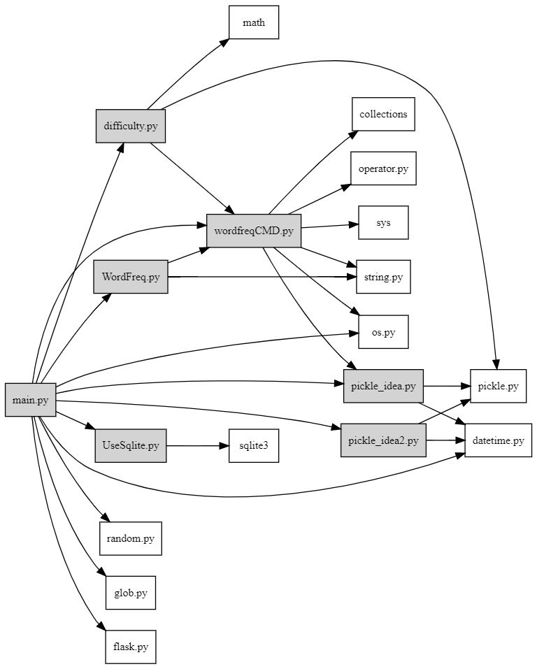
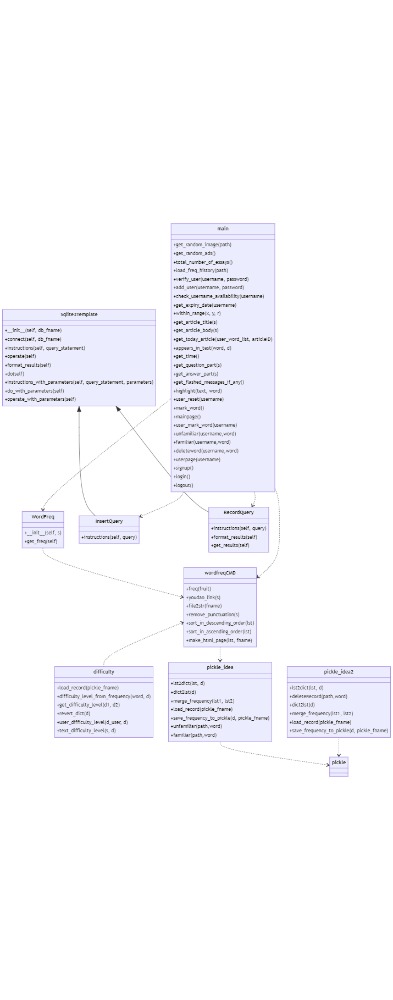

.. EnglishPal documentation master file, created by
   sphinx-quickstart on Mon Nov 22 23:05:00 2021.
   You can adapt this file completely to your liking, but it should at least
   contain the root `toctree` directive.

**Lab 1**: Dependency Analysis and Dependency Graph
======================================

.. toctree::
   :maxdepth: 2
   :caption: Contents:

**小组成员**

201932110105沈音棋

201932110104马奕琪

201932110106孙仪杰

201932110107田西芷

**项目GitHub地址**: `EnglishPal`_.

.. _EnglishPal: https://github.com/ChiefEye-official/Test/

**项目Read the Doc地址**: `Read the Doc`_.

.. _Read The Doc: https://readthedocs.org/projects/testenglishpal/

Abstract
======================================

找出EnglishPal中模块/类/函数之间的依赖关系，绘制依赖图，分析EnglishPal当前依赖关系利弊。

Introduction
======================================

EnglishPal是智能捕捉阅读弱点，针对性提高用户的阅读水平的网站。提高用户的获取英文信息的速度与准确度。提供精选短文和生词簿，对于英语老师，English Pal 可以帮助掌握题目词汇规律，提高教学质量。对于英语学着，English Pal可以帮助迅速提高词汇，轻松应对各种考试。本次实验针对EnglishPal源代码，分析当前模块级依赖关系以及类/函数级依赖关系，分析当前体系结构。

Methods and materials
======================================

①Snakefood：从Python代码中生成依赖，过滤，聚类，并从依赖列表中生成图表。使用Snakefood捕获模块级依赖关系。

②Graphviz：开源的图形可视化软件。使用graphviz online渲染依赖关系图。

③Mermaid：基于Javascript的图表和图表工具，使用文本和代码创建图表和可视化，以便动态地创建和修改图表。使用mermaid live editor渲染类/函数级依赖关系图。

Results
======================================

**snakefood.dot**
::
      # This file was generated by snakefood3.
      strict digraph "dependencies" {
          graph [
              rankdir = "LR",
              overlap = "scale",
              size = "8,10",
              ratio = "fill",
              fontsize = "16",
              fontname = "Helvetica",
              clusterrank = "local"
              ]

             node [
                 fontsize=12
                 shape=box
             ];

      "difficulty.py"  [style=filled];
      "difficulty.py" -> "wordfreqCMD.py";
      "difficulty.py" -> "math";
      "difficulty.py" -> "pickle.py";
      "main.py"  [style=filled];
      "main.py" -> "WordFreq.py";
      "main.py" -> "wordfreqCMD.py";
      "main.py" -> "UseSqlite.py";
      "main.py" -> "pickle_idea.py";
      "main.py" -> "pickle_idea2.py";
      "main.py" -> "os.py";
      "main.py" -> "random.py";
      "main.py" -> "glob.py";
      "main.py" -> "datetime.py";
      "main.py" -> "flask.py";
      "main.py" -> "difficulty.py";
      "pickle_idea.py"  [style=filled];
      "pickle_idea.py" -> "pickle.py";
      "pickle_idea.py" -> "datetime.py";
      "pickle_idea2.py"  [style=filled];
      "pickle_idea2.py" -> "pickle.py";
      "pickle_idea2.py" -> "datetime.py";
      "UseSqlite.py"  [style=filled];
      "UseSqlite.py" -> "sqlite3";
      "WordFreq.py"  [style=filled];
      "WordFreq.py" -> "wordfreqCMD.py";
      "WordFreq.py" -> "string.py";
      "wordfreqCMD.py"  [style=filled];
      "wordfreqCMD.py" -> "collections";
      "wordfreqCMD.py" -> "string.py";
      "wordfreqCMD.py" -> "operator.py";
      "wordfreqCMD.py" -> "os.py";
      "wordfreqCMD.py" -> "sys";
      "wordfreqCMD.py" -> "pickle_idea.py";

      }

依赖图

**mermaid.txt**
::
      classDiagram
          WordFreq ..> wordfreqCMD
          wordfreqCMD <.. difficulty
          wordfreqCMD..> pickle_idea
          main ..> wordfreqCMD
          main ..> WordFreq
          pickle_idea ..> pickle
          pickle_idea2 ..> pickle
          Sqlite3Template <|-- InsertQuery
          Sqlite3Template <|-- RecordQuery
          main ..> InsertQuery
          main ..> RecordQuery

          class difficulty{
          +load_record(pickle_fname)
          +difficulty_level_from_frequency(word, d)
          +get_difficulty_level(d1, d2)
          +revert_dict(d)
          +user_difficulty_level(d_user, d)
          +text_difficulty_level(s, d)
      }
          class pickle_idea{
          +lst2dict(lst, d)
          +dict2lst(d)
          +merge_frequency(lst1, lst2)
          +load_record(pickle_fname)
          +save_frequency_to_pickle(d, pickle_fname)
          +unfamiliar(path,word)
          +familiar(path,word)
      }
          class pickle_idea2{
          +lst2dict(lst, d)
          +deleteRecord(path,word)
          +dict2lst(d)
          +merge_frequency(lst1, lst2)
          +load_record(pickle_fname)
          +save_frequency_to_pickle(d, pickle_fname)
      }
          class pickle{

      }
          class Sqlite3Template{
          +__init__(self, db_fname)
          +connect(self, db_fname)
          +instructions(self, query_statement)
          +operate(self)
          +format_results(self)
          +do(self)
          +instructions_with_parameters(self, query_statement, parameters)
          +do_with_parameters(self)
          +operate_with_parameters(self)
      }
          class InsertQuery{
          +instructions(self, query)
      }
          class RecordQuery{
          +instructions(self, query)
          +format_results(self)
          +get_results(self)
      }
          class WordFreq{
          +__init__(self, s)
          +get_freq(self)
      }
          class wordfreqCMD{
          +freq(fruit)
          +youdao_link(s)
          +file2str(fname)
          +remove_punctuation(s)
          +sort_in_descending_order(lst)
          +sort_in_ascending_order(lst)
          +make_html_page(lst, fname)
      }
          class main{
          +get_random_image(path)
          +get_random_ads()
          +total_number_of_essays()
          +load_freq_history(path)
          +verify_user(username, password)
          +add_user(username, password)
          +check_username_availability(username)
          +get_expiry_date(username)
          +within_range(x, y, r)
          +get_article_title(s)
          +get_article_body(s)
          +get_today_article(user_word_list, articleID)
          +appears_in_test(word, d)
          +get_time()
          +get_question_part(s)
          +get_answer_part(s)
          +get_flashed_messages_if_any()
          +highlight(text, word)
          +user_reset(username)
          +mark_word()
          +mainpage()
          +user_mark_word(username)
          +unfamiliar(username,word)
          +familiar(username,word)
          +deleteword(username,word)
          +userpage(username)
          +signup()
          +login()
          +logout()
      }

依赖图

依赖分析：
======================================

①wordfreqCMD.py
wordfreqCMD将字符串转换为列表，得到每个单词的词频；wordFreq依赖于wordfreqCMD，初始化文章；difficulty依赖于wordfreqCMD，计算文章的难度等级；main依赖于wordfreqCMD，有道的链接和按降序排列。

②pickle

pickle_idea依赖于pickle，列表llist中的信息存储到字典中，记录单词和词频；pickle_idea2依赖于pickle，列表llist中的信息存储到字典中，记录单词和日期；将这些函数合并到wordfreqCMD.py中，wordfreqCMD依赖于pickle_idea，显示积累频率。

③UseSqlite.py

Sqlite3Template 连接数据库；InsertQuery继承Sqlite3Template，插入数据；RecordQuery继承Sqlite3Template，记录数据。

④Main.py

获取文章get_today_article，依赖于RecordQuery数据记录、调用方法get_difficulty_level根据读者的阅读水平选择文章、根据pickle_idea2根据记录高亮生词；显示主页面mainpage，依赖于WordFreq、wordfreqCMD；问题与答案交互方法get_question_part、get_answer_part等；用户页面，勾选生词userpage，依赖于WordFreq、wordfreqCMD；单词熟悉度操作，包括load_freq_history；unfamiliar；familiar等；用户注册登录退出signup、login、logout、add_user依赖于InsertQuery。

架构利弊分析
======================================

弊端：EnglishPal的主要页面与功能集中在main.py中，功能代码中嵌入了大量网页前端代码，前后端混杂。进行前后端分离的重构有助于解放前端，不需要向后台提供模板，或是在前端html中嵌入后台代码；提高工作效率，分工更加明确；局部性能提升，实现页面的按需加载，在页面交互和用户体验上有所提升；降低维护成本，快速定位问题所在。优点：前后端之间没有通信成本，功能清晰，无大量重复代码。使用适用于小型网站的Flask框架，使得项目灵活，可扩展性强，第三方库的选择多。

Discussion
======================================

通过对EnglishPal的依赖关系分析，对EnglishPal的架构有了清晰的认知。学习使用snakefood生成模块级依赖关系snakefood.dot，并用graphviz渲染；用mermain绘制类/函数级依赖关系图。掌握对已有项目的结构和依赖关系分析方法，对项目重构有更深的认识。

References
======================================

[1] Martin Blais, Snakefood User Manual, Copyright (C) 2001-2007

   
